# Raytracer -- Miranda Scully 

## Overview 
This project is a sophisticated raytracing engine that supports a range of advanced rendering features. It provides a versatile platform for creating high-quality, photorealistic images and animations. The raytracer can handle various geometric shapes, textures, and lighting models.
## Functions 

- **Shape intersection**: implemented for sphere, quad, and planar circle 
- **Lighting**: Point and directional lights with shadow  calculations.
- **Reflection**: Recursive raytracing for reflective surfaces.
-**Ray-scene intersection**: finds the closest intersection of a ray in a scene 
- **Antialiasing**: Sampled rays for smoother images.

## Outputs 

00 Sphere
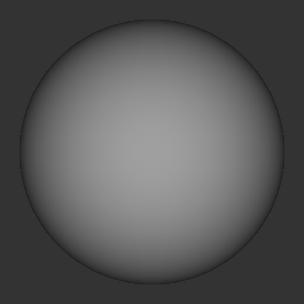

01 Ambient Sphere 
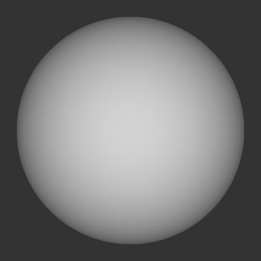

02 Sphere Room 
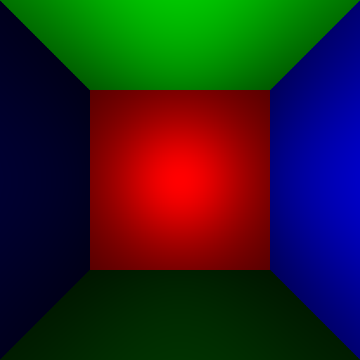

03 Quad 
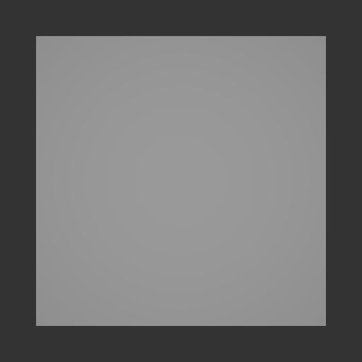

04 Quad Room 
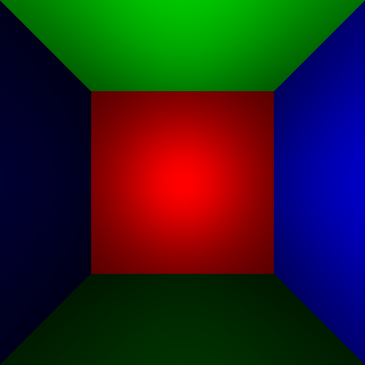

05 Ball on plane 
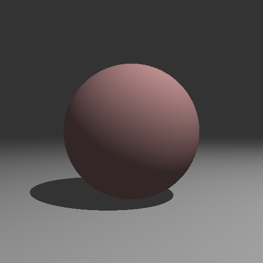

06 Balls on Plane 
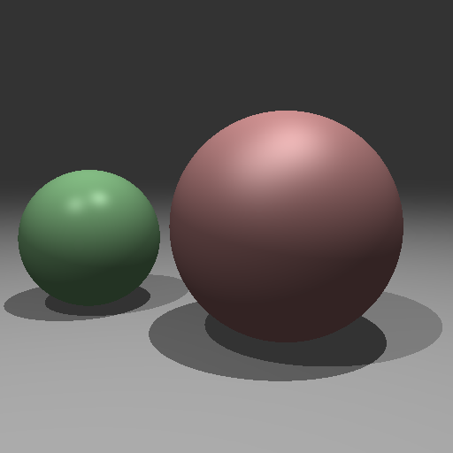

07 Reflections 
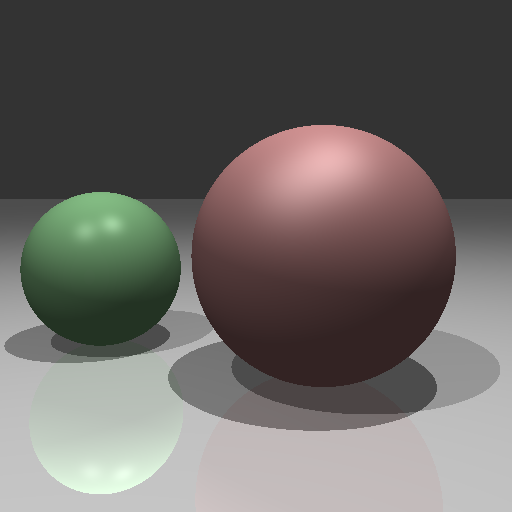

08 Antialiased

09 Planar Circle **ELECTIVE CREDIT 
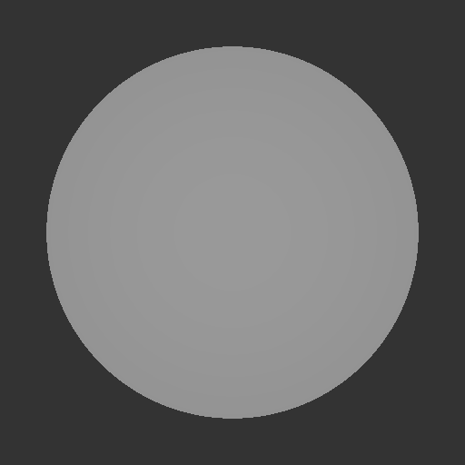

10 Directional Light **ELECTIVE CREDIT 
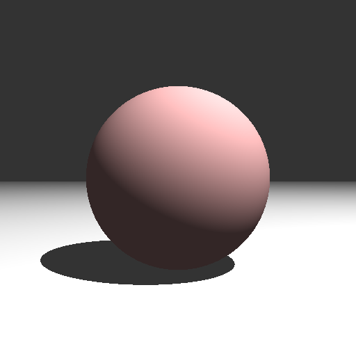

11 & 12 Gradient Background **CREATIVE ELEMENT
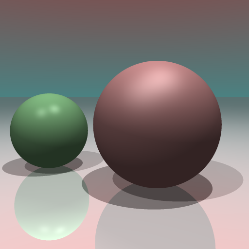
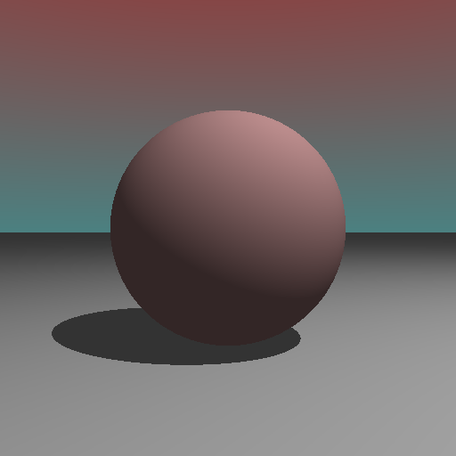